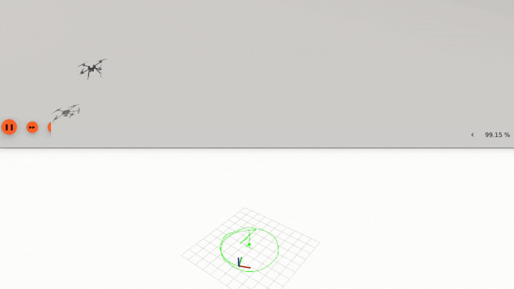
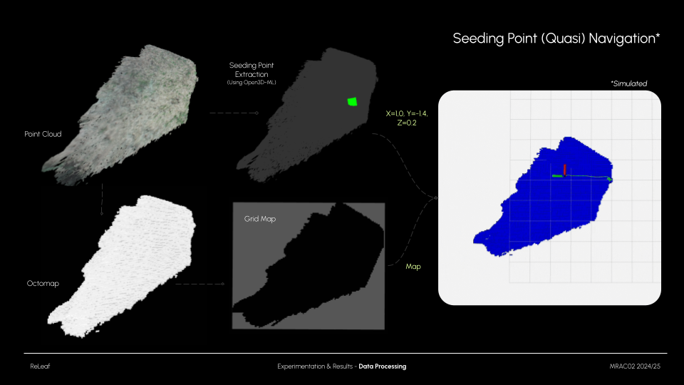

# Holybro Drone Simulation ROS2



## Overview

This tutorial explains at a basic level how to use ROS2 and PX4 in order to control a simulated UAV's velocity with keyboard controls and 3D position goals.

This repo is a derivative of ARK Electronics Offboard example:
[https://github.com/ARK-Electronics/ROS2_PX4_Offboard_Example]()

### Prerequisites

* ROS2 Humble
* PX4 Autopilot
* Micro XRCE-DDS Agent
* Ubuntu 22.04
* Python 3.10

## Setup Steps

### Install PX4 Autopilot

To [Install PX4](https://docs.px4.io/main/en/dev_setup/dev_env_linux_ubuntu.html#simulation-and-nuttx-pixhawk-targets) run this code

```
git clone https://github.com/PX4/PX4-Autopilot.git --recursive
```

Run this script in a bash shell to install everything

```
bash ./PX4-Autopilot/Tools/setup/ubuntu.sh
```

You will now need to restart your computer before continuing.

### Install ROS2 Humble

To install ROS2 Humble follow the steps [here](https://docs.ros.org/en/humble/Installation/Ubuntu-Install-Debians.html)

### Install Dependencies

Install Python dependencies as mentioned in the [PX4 Docs](https://docs.px4.io/main/en/ros/ros2_comm.html#install-ros-2) with this code

```
pip3 install --user -U empy pyros-genmsg setuptools
```

I also found that without these packages installed Gazebo has issues loading

```
pip3 install kconfiglib
pip install --user jsonschema
pip install --user jinja2
```

### Build Micro DDS

As mentioned in the [PX4 Docs](https://docs.px4.io/main/en/ros/ros2_comm.html#setup-micro-xrce-dds-agent-client) run this code in order to build MicroDDS on your machine

```
git clone https://github.com/eProsima/Micro-XRCE-DDS-Agent.git
cd Micro-XRCE-DDS-Agent
mkdir build
cd build
cmake ..
make
sudo make install
sudo ldconfig /usr/local/lib/
```

### Create a Workspace

Run this code to create a workspace in your home directory:

```
mkdir -p ~/ros2_drone_ws/src
cd ~/ros2_drone_ws/src
```

### Clone the Repo

Run this code to clone in this package:

```
git clone https://github.com/ainhoaarnaiz/holybro_drone_simulation_ros2.git
```

### Building the Workspace

Run this code to do that:

```
source /opt/ros/humble/setup.bash
cd ..
colcon build
source install/setup.bash
```

**IMPORTANT**: You will need to build the workspace every time we make changes to the code.

### Running the Code

This example has been designed to run from one launch file that will start all the necessary nodes. The launch file will run a python script that uses gnome terminal to open a new terminal window for MicroDDS and Gazebo.

Run this code to start the example

```
ros2 launch px4_offboard offboard_velocity_control.launch.py
```

You can choose between teleoperating the drone from the terminal or using the Jupyter Notebook `drone_commander.ipynb`. The Drone Commander allows you to control the drone by setting:

* Velocity
* 3D point
* GPS location *(coming soon)*

To enable (quasi) navigation, you also need to launch the following command:

```
ros2 run octomap_server octomap_server_node --ros-args -p frame_id:=map -p resolution:=0.05 -p latch:=true -p octomap_path:=/home/path/to/map.bt
```

An example `.bt` map is available in the `maps` folder. If you want to create your own map from a point cloud or mesh, you can run the following commands (make sure to update the **.ply** input path in `pcd_publisher.py` and update the output **.bt** path in `save_octomap_node.cpp`):

```
ros2 run pcd_tools pcd_publisher
ros2 run octomap_server octomap_server_node --ros-args -r /cloud_in:=/points
ros2 run octomap_tools save_octomap_node
```



*Note: For .bt visualization you can use octovis (if you don't want to use Rviz2)*

```
octovis /home/path/to/map.bt
```

## Closing Simulation *IMPORTANT*

When closing the simulation, it is very tempting to just close the terminal windows. However, this will leave Gazebo running in the background, potentially causing issues when you run Gazebo in the future. To correctly end the Gazebo simulation, go to it's terminal window and click *Ctrl+C*. This will close Gazebo and all of it's child processes. Then, you can close the other terminal windows.

## Explanation of processes.py

This code runs each set of bash commands in a new tab of a gnome terminal window. It assumes that your PX4 installation is accessible from your root directory, and it is using the gz_x500 simulation. There is no current implementation to change these commands when running the launch file, however you can modify the command string within processes.py to change these values to what you need.

 If line 17 of processes.py were uncommented

```
17     # "cd ~/QGroundControl && ./QGroundControl.AppImage"
```

then QGroundControl would run in a new tab of the terminal window and the QGroundControl GUI would then open up. This is commented out by default because it is not necessary for the simulation to run, but it is useful for debugging, and is a simple example showing how to add another command to the launch file.
